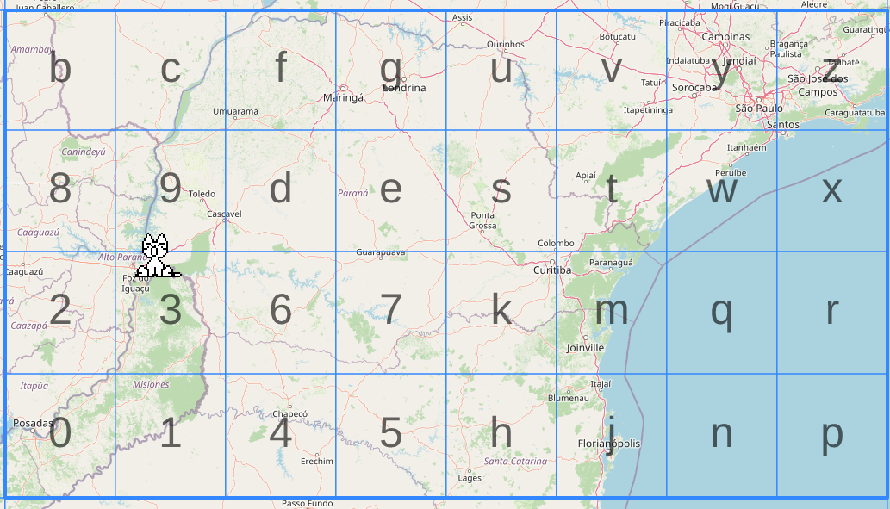

# How GeoHash works

## What is GeoHash ?

GeoHash is a system that converts geographic coordinates (latitude and longitude)
into a short string of characters.
For example, the coordinates `49.489508, 0.125283` become `u0ke`.

---

## How it works

GeoHash works by repeatedly dividing the world in half and encoding
whether your position is in the left or right half (0 or 1).

The key rule is that bits **alternate between longitude and latitude** :
- Odd bits (1st, 3rd, 5th...) → longitude
- Even bits (2nd, 4th, 6th...) → latitude

---

## Example : latitude 49.489508, longitude 0.125283

### Step 1 : Encode bits one by one

| Bit | Axis      | Range            | Middle | Value | New Range       |
|-----|-----------|------------------|--------|-------|-----------------|
| 1   | Longitude | -180 to 180      | 0      | 1     | 0 to 180        |
| 2   | Latitude  | -90 to 90        | 0      | 1     | 0 to 90         |
| 3   | Longitude | 0 to 180         | 90     | 0     | 0 to 90         |
| 4   | Latitude  | 0 to 90          | 45     | 1     | 45 to 90        |
| 5   | Longitude | 0 to 90          | 45     | 0     | 0 to 45         |

Result : `11010`

### Step 2 : Group bits by 5

Once you have enough bits, group them by 5 :
### Step 3 : Convert to base 32

GeoHash uses a base 32 alphabet :
0123456789bcdefghjkmnpqrstuvwxyz
.

`11010` in base 10 = `26` → in GeoHash base 32 = `u`

Repeat this process with more bits to get a longer, more precise GeoHash.

---

## Precision

The more characters in the GeoHash, the more precise the location :

| Length | Precision       |
|--------|-----------------|
| 1      | ~5000 km        |
| 3      | ~156 km         |
| 5      | ~4.9 km         |
| 7      | ~153 m          |
| 9      | ~4.8 m          |

---
---
## Final result

Repeating the process for 7 characters gives the following GeoHash :

| Character | Bits  | Base 32 |
|-----------|-------|---------|
| 1st       | 11010 | u       |
| 2nd       | 00000 | 0       |
| 3rd       | 01010 | b       |
| 4th       | 00001 | 1       |
| 5th       | 01101 | d       |
| 6th       | ?     | ?       |
| 7th       | ?     | ?       |

Result for `49.489508, 0.125283` with accuracy 7 → **`u0b1dc7`**

You can verify your result on the following website :
* [Test GeoHash online](https://www.movable-type.co.uk/scripts/geohash.html)

🤔 Interesting... this location looks familiar

---

## Helpful links

* [GeoHash official site](http://geohash.org)
* [Wikipedia - Geohash](https://en.wikipedia.org/wiki/Geohash)